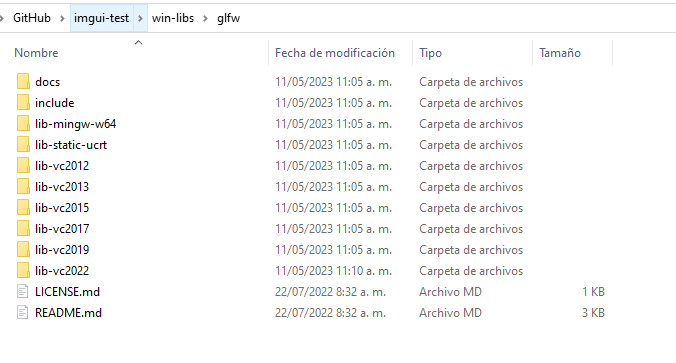

# imgui-test

A simple project that runs **Dear ImGui** *example_glfw_opengl3* demo.

## Linux

* Fedora:

  ```
  sudo dnf install glfw-devel
  make
  ```

* Ubuntu:

  ```
  apt-get install libglfw-dev
  make
  ```

## Windows

Download [GLFW 64-bit pre-compiled binaries for Windows](https://github.com/glfw/glfw/releases/download/3.3.8/glfw-3.3.8.bin.WIN64.zip). Open the zip and open the folder *glfw-3.3.8.bin.WIN64* and extract the contents in the folder **win-libs/glfw** under the project (create any folder that does not exist). In the end it should look like this:



The project it's configured to work with Visual Studio 2022, in case that you want to use another version, you'll need to edit **imgui-test.vcxproj** (search for *vc2022* and replace it with a valid version from the ones seen in the previous image).

